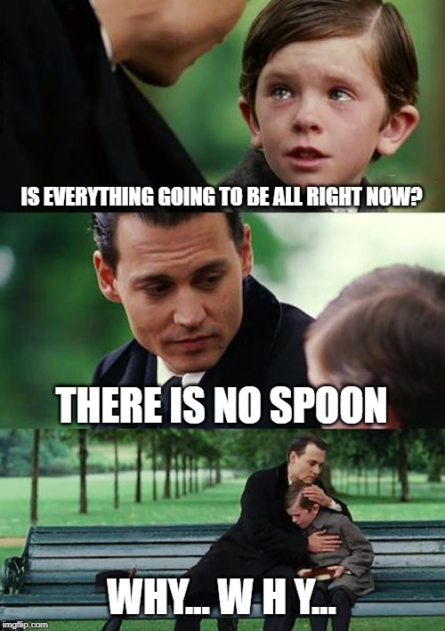
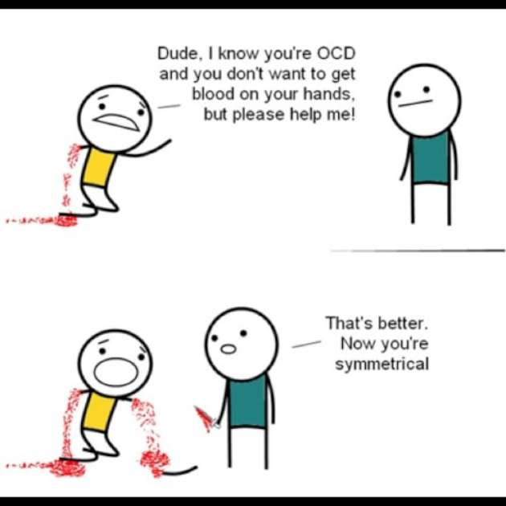
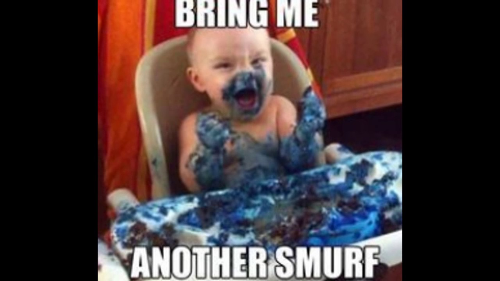
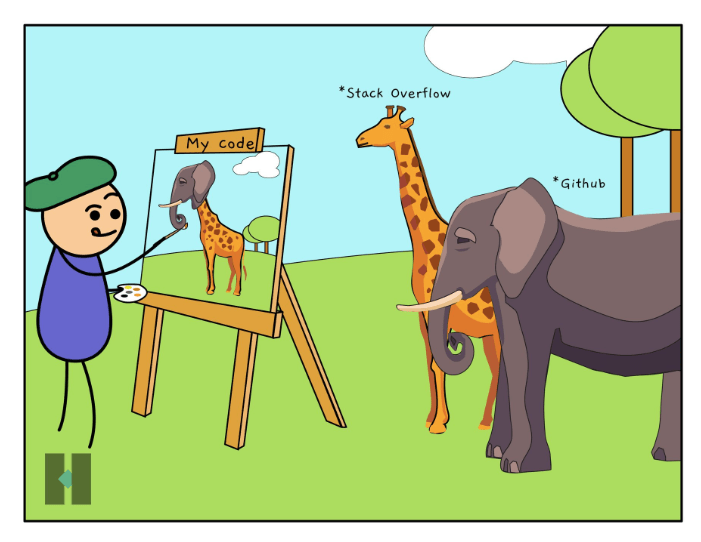
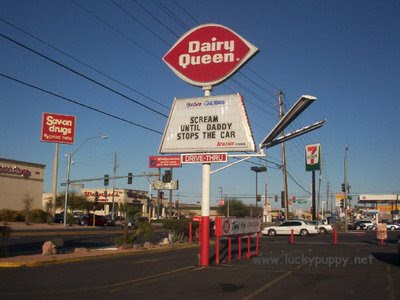

<html>

<h1>
Memes
</h1>
<h1>Please dont. These memes havent been updated or rotated for 3 years.</h1>

 

 

 

 

 

 

 

 

 

 

 

 

 

 

 

 
<button onclick="window.location.href = 'index';">Back to Home Page</button>
</html>
